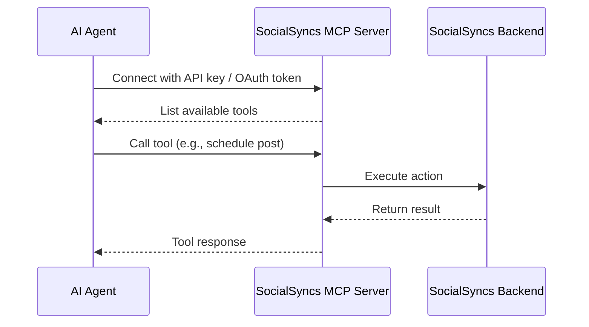

MCP (Model Context Protocol) lets AI agents interact with SocialSyncs directly — listing integrations, scheduling posts, generating images and videos — all through a standardized tool-calling interface.

This means you can connect Claude, ChatGPT, Cursor, or any MCP-compatible client to your SocialSyncs account and manage your social media through natural language.

## How It Works

SocialSyncs exposes an MCP server that provides a set of tools to AI agents. The agent discovers these tools, understands their schemas, and calls them on your behalf.



## Available Tools

| Tool | Description |
|------|-------------|
| `integrationList` | List all connected social media accounts (optionally filtered by group) |
| `groupList` | List all groups (customers) for your organization |
| `integrationSchema` | Get platform-specific posting rules and settings schema |
| `triggerTool` | Execute platform-specific helpers (e.g., list Discord channels) |
| `schedulePostTool` | Schedule, draft, or immediately publish posts |
| `generateImageTool` | Generate AI images for posts |
| `generateVideoOptions` | List available video generation options |
| `videoFunctionTool` | Get video generator settings (e.g., available voices) |
| `generateVideoTool` | Generate videos for posts |

## Authentication

There are two ways to authenticate with the MCP server:

### API Key

Get your API key from **Settings > Developers > Public API** in SocialSyncs. Use it directly in the MCP endpoint URL or as a Bearer token.

### OAuth Token

If you're building an app for other SocialSyncs users, use [OAuth2](/public-api/oauth) to obtain tokens. OAuth tokens start with `pos_` and work the same way as API keys.

## Connecting

<Tabs>
  <Tab title="Bearer Token">
    Use the `/mcp` endpoint with your API key or OAuth token as a Bearer token:

    ```
    URL: https://api.socialsyncs.co/mcp
    Authorization: Bearer your-api-key
    ```

    This method supports both API keys and OAuth tokens (prefixed with `pos_`).
  </Tab>
  <Tab title="API Key in URL">
    Use the `/mcp/:apiKey` endpoint with your API key embedded in the URL:

    ```
    URL: https://api.socialsyncs.co/mcp/your-api-key
    ```
  </Tab>
</Tabs>

<Note>
For self-hosted instances, replace `https://api.socialsyncs.co` with your `NEXT_PUBLIC_BACKEND_URL`.
</Note>

## Quick Example

Here's what a typical interaction looks like when an AI agent uses SocialSyncs MCP:

1. **Agent calls `integrationList`** — gets back your connected accounts (X, LinkedIn, etc.)
2. **Agent calls `integrationSchema`** with `platform: "x"` — learns X's character limits, settings, and rules
3. **Agent calls `schedulePostTool`** — schedules your post with the correct format

All of this happens automatically when you tell your AI agent something like:

> "Schedule a post to X for tomorrow at 10am: Excited to announce our new feature!"

## FAQ

### Do I need an OpenAI key to use SocialSyncs MCP?

No. The MCP server just exposes SocialSyncs's tools — your AI client (Claude, ChatGPT, Cursor, etc.) provides the model. SocialSyncs only needs an `OPENAI_API_KEY` if you use SocialSyncs's own AI features (image generation, copilot) which are separate from the MCP tools surfaced to your client.

### What happens when my API key expires or is rotated?

SocialSyncs API keys don't auto-rotate, but if you regenerate one in Settings → Developers → Public API, every MCP client using the old key stops working until you update its config. Update the URL or the `Authorization` header in your client config and reconnect.

### Self-hosted: how do I expose the MCP endpoint?

The MCP server starts as part of the SocialSyncs backend and is reachable at `/mcp` (Bearer auth), `/mcp/:apiKey` (key in URL), and `/mcp-oauth` (OAuth-protected). Your reverse proxy must forward these paths to the backend and support streaming HTTP (`Transfer-Encoding: chunked`). See [Reverse Proxies](/reverse-proxies/caddy).

### Can MCP read or reply to comments?

Not today. The current tool set is read-only on integrations and write-only on posts/media — there's no `getComments` or `replyToComment` exposed via MCP. Comment replies must be triggered through the SocialSyncs UI.
