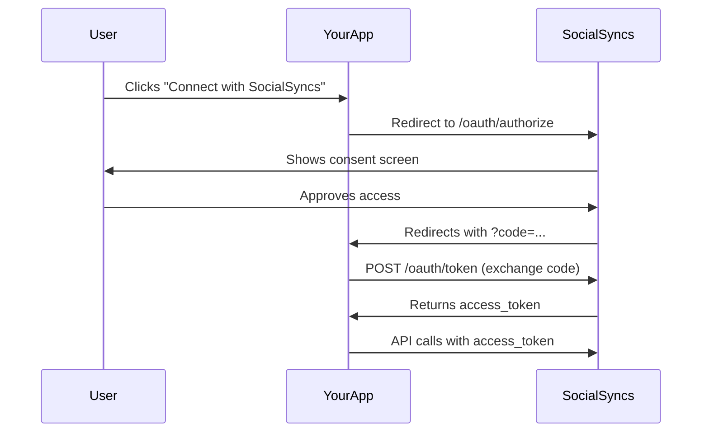

## Overview

SocialSyncs supports OAuth2 Authorization Code flow, allowing you to build third-party applications that act on behalf of SocialSyncs users. Instead of asking users for their API key, your app redirects them to SocialSyncs where they approve access, and you receive a token to make API calls on their behalf.

<Info>
OAuth tokens work with all the same Public API endpoints as API keys. The only difference is how the token is obtained.
</Info>

## How It Works



## Implementation

<Steps>
  <Step title="Register Your OAuth App">
    Go to **Settings > Developers > Apps** in your SocialSyncs dashboard and create an OAuth application.

    You will need to provide:
    - **App Name** - displayed to users on the consent screen
    - **Description** (optional) - explains what your app does
    - **Profile Picture** (optional) - shown on the consent screen
    - **Redirect URL** - where SocialSyncs sends users after they approve/deny access

    After creating the app, you will receive:
    - **Client ID** - a public identifier for your app (starts with `pca_`)
    - **Client Secret** - a secret key for token exchange (starts with `pcs_`)

    <Warning>
    The client secret is only shown once on creation. Copy it immediately and store it securely. If you lose it, you can rotate it from the settings page.
    </Warning>
  </Step>

  <Step title="Redirect Users to Authorize">
    When a user wants to connect their SocialSyncs account to your app, redirect them to:

    ```
    https://{FRONTEND_URL}/oauth/authorize?client_id={CLIENT_ID}&response_type=code&state={STATE}
    ```

    | Parameter | Required | Description |
    |-----------|----------|-------------|
    | `client_id` | Yes | Your app's Client ID |
    | `response_type` | Yes | Must be `code` |
    | `state` | No | A random string to prevent CSRF attacks. Recommended. |

    **Example:**

    ```bash
    https://app.socialsyncs.co/oauth/authorize?client_id=pca_VklHTpdEJ6dJ73FHQEJ97qVA0lcMDsrs&response_type=code&state=random123
    ```

    The user will see a consent screen showing your app's name, description, and the permissions being requested. They can choose to **Authorize** or **Deny**.
  </Step>

  <Step title="Handle the Callback">
    After the user makes a decision, SocialSyncs redirects them to your **Redirect URL** with query parameters.

    **If approved:**

    ```
    https://yourapp.com/callback?code=abc123&state=random123
    ```

    | Parameter | Description |
    |-----------|-------------|
    | `code` | Authorization code to exchange for a token (expires in 10 minutes) |
    | `state` | The same state value you sent in the previous step |

    **If denied:**

    ```
    https://yourapp.com/callback?error=access_denied&state=random123
    ```

    <Tip>
    Always verify that the `state` parameter matches what you originally sent to prevent CSRF attacks.
    </Tip>
  </Step>

  <Step title="Exchange Code for Token">
    Make a server-side `POST` request to exchange the authorization code for an access token:

    ```bash
    curl -X POST https://{BACKEND_URL}/oauth/token \
      -H "Content-Type: application/json" \
      -d '{
        "grant_type": "authorization_code",
        "code": "abc123",
        "client_id": "pca_VklHTpdEJ6dJ73FHQEJ97qVA0lcMDsrs",
        "client_secret": "pcs_your_client_secret"
      }'
    ```

    | Parameter | Required | Description |
    |-----------|----------|-------------|
    | `grant_type` | Yes | Must be `authorization_code` |
    | `code` | Yes | The authorization code from the previous step |
    | `client_id` | Yes | Your app's Client ID |
    | `client_secret` | Yes | Your app's Client Secret |

    **Response:**

    ```json
    {
      "id": "org_abc123",
      "cus": "cus_stripe_customer_id",
      "access_token": "pos_aBcDeFgHiJkLmNoPqRsTuVwXyZ1234567890abcd",
      "token_type": "bearer"
    }
    ```

    | Field | Description |
    |-------|-------------|
    | `id` | The organization ID associated with the authorized user |
    | `cus` | The Stripe customer ID for the organization (useful for billing integrations) |
    | `access_token` | The token to use for subsequent API calls |
    | `token_type` | Always `bearer` |

    <Warning>
    The authorization code expires after **10 minutes** and can only be used once. If it expires, the user must go through the authorization flow again.
    </Warning>
  </Step>

  <Step title="Make API Calls">
    Use the access token in the `Authorization` header, just like you would with an API key:

    ```bash
    curl -H "Authorization: pos_aBcDeFgHiJkLmNoPqRsTuVwXyZ1234567890abcd" \
      https://{BACKEND_URL}/public/v1/integrations
    ```

    The token works with all Public API endpoints:
    - [List Integrations](/public-api/integrations/list)
    - [Create Posts](/public-api/posts/create)
    - [View Analytics](/public-api/analytics/platform)
    - And all other endpoints documented in this API reference

    <Info>
    OAuth tokens do not expire. Users can revoke access at any time from **Settings > Approved Apps** in their SocialSyncs dashboard.
    </Info>
  </Step>
</Steps>

---

## Managing Your App

### Rotate Client Secret

If your client secret is compromised, go to **Settings > Developers > Apps** and click **Rotate Secret**. This invalidates the old secret immediately — any token exchange requests using the old secret will fail.

<Note>
Rotating the secret does **not** invalidate existing access tokens. Only new token exchange requests require the new secret.
</Note>

### Delete Your App

Deleting your OAuth app will:
- Revoke **all** access tokens issued to users
- Remove the app from all users' Approved Apps list
- This action cannot be undone

---

## Full Example (Node.js)

```javascript
const express = require('express');
const crypto = require('crypto');
const app = express();

const CLIENT_ID = 'pca_your_client_id';
const CLIENT_SECRET = 'pcs_your_client_secret';
const POSTIZ_URL = 'https://app.socialsyncs.co';
const BACKEND_URL = 'https://app.socialsyncs.co/api';
const REDIRECT_URL = 'https://yourapp.com/callback';

// Step 2: Redirect user to SocialSyncs
app.get('/connect', (req, res) => {
  const state = crypto.randomBytes(16).toString('hex');
  // Store state in session for CSRF verification
  req.session.oauthState = state;

  const params = new URLSearchParams({
    client_id: CLIENT_ID,
    response_type: 'code',
    state,
  });

  res.redirect(`${POSTIZ_URL}/oauth/authorize?${params}`);
});

// Step 3 & 4: Handle callback and exchange code
app.get('/callback', async (req, res) => {
  const { code, state, error } = req.query;

  // Check for denial
  if (error === 'access_denied') {
    return res.send('User denied access');
  }

  // Verify state
  if (state !== req.session.oauthState) {
    return res.status(403).send('Invalid state');
  }

  // Exchange code for token
  const response = await fetch(`${BACKEND_URL}/oauth/token`, {
    method: 'POST',
    headers: { 'Content-Type': 'application/json' },
    body: JSON.stringify({
      grant_type: 'authorization_code',
      code,
      client_id: CLIENT_ID,
      client_secret: CLIENT_SECRET,
    }),
  });

  const { id, cus, access_token } = await response.json();

  // Store access_token securely and use it for API calls
  // Example: fetch user's integrations
  const integrations = await fetch(
    `${BACKEND_URL}/public/v1/integrations`,
    { headers: { Authorization: access_token } }
  ).then(r => r.json());

  res.json({ connected: true, integrations });
});

app.listen(3000);
```

---

## Error Reference

| Error | When | Description |
|-------|------|-------------|
| `invalid_client` | Token exchange | Client ID or Client Secret is wrong |
| `invalid_grant` | Token exchange | Code is invalid, expired, or already used |
| `unsupported_grant_type` | Token exchange | `grant_type` is not `authorization_code` |
| `access_denied` | Callback | User denied the authorization request |
